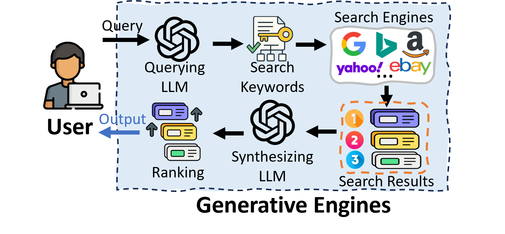

# SoK: Generative Engine Optimization (GEO)

A research-oriented collection for **Generative Engine Optimization (GEO)**, AI search optimization, generative search, citation visibility, retrieval manipulation, and agentic web/search systems.

GEO studies how content, evidence, products, webpages, and agents become visible, cited, or absorbed by generative engines such as ChatGPT, Perplexity, Gemini, Google AI Overviews, and other LLM-based search systems.

---

## Contents

- [2026 Papers](#2026-papers)
- [2025 Papers](#2025-papers)
- [2024 Papers](#2024-papers)
- [2023 Papers](#2023-papers)
- [Benchmarks, Datasets, and Evaluation](#benchmarks-datasets-and-evaluation)
- [Adversarial GEO, Manipulation, and Security](#adversarial-geo-manipulation-and-security)
- [Agentic GEO and Multi-Agent Search](#agentic-geo-and-multi-agent-search)
- [E-Commerce, Product Visibility, and Agentic Commerce](#e-commerce-product-visibility-and-agentic-commerce)
- [Retrieval, Citation, and Knowledge Conflict](#retrieval-citation-and-knowledge-conflict)
- [Open-Source Projects](#open-source-projects)
- [Related Surveys and Search Papers](#related-surveys-and-search-papers)

---

## 2026 Papers

- [2026-05-21] SCI-Defense: Defending Manipulation Attacks from Generative Engine Optimization [[Paper](https://arxiv.org/abs/2605.21948)]

- [2026-05-13] EcoGEO: Trajectory-Aware Evidence Ecosystems for Web-Enabled LLM Search Agents [[Paper](https://arxiv.org/abs/2605.12887)]

- [2026-04-30] How Generative AI Disrupts Search: An Empirical Study of Google Search, Gemini, and AI Overviews [[Paper](https://arxiv.org/abs/2604.27790)]

- [2026-04-28] From Citation Selection to Citation Absorption: A Measurement Framework for Generative Engine Optimization Across AI Search Platforms [[Paper](https://arxiv.org/abs/2604.25707)]

- [2026-04-21] From Experience to Skill: Multi-Agent Generative Engine Optimization via Reusable Strategy Learning [[Paper](https://arxiv.org/abs/2604.19516)] [[Code](https://github.com/Wu-beining/MAGEO)]

- [2026-04-21] Think Before Writing: Feature-Level Multi-Objective Optimization for Generative Citation Visibility [[Paper](https://arxiv.org/abs/2604.19113)]

- [2026-04-13] AgentWebBench: Benchmarking Multi-Agent Coordination in Agentic Web [[Paper](https://arxiv.org/abs/2604.10938)]

- [2026-04-08] Don't Measure Once: Measuring Visibility in AI Search (GEO) [[Paper](https://arxiv.org/abs/2604.07585)]

- [2026-04-04] Beyond Retrieval: Modeling Confidence Decay and Deterministic Agentic Platforms in Generative Engine Optimization [[Paper](https://arxiv.org/abs/2604.03656)]

- [2026-03-31] Structural Feature Engineering for Generative Engine Optimization: How Content Structure Shapes Citation Behavior [[Paper](https://arxiv.org/abs/2603.29979)]

- [2026-03-10] Diagnosing and Repairing Citation Failures in Generative Engine Optimization [[Paper](https://arxiv.org/abs/2603.09296)]

- [2026-03-02] AgenticGEO: A Self-Evolving Agentic System for Generative Engine Optimization [[Paper](https://arxiv.org/abs/2603.20213)] [[Code](https://github.com/AIcling/agentic_geo)]

- [2026-02-12] SAGEO Arena: A Realistic Environment for Evaluating Search-Augmented Generative Engine Optimization [[Paper](https://arxiv.org/abs/2602.12187)]

- [2026-02-03] Generative Engine Optimization: A VLM and Agent Framework for Pinterest Acquisition Growth [[Paper](https://arxiv.org/abs/2602.02961)]

- [2026-02-03] Controlling Output Rankings in Generative Engines for LLM-based Search [[Paper](https://arxiv.org/abs/2602.03608)]

- [2026-01-23] IF-GEO: Conflict-Aware Instruction Fusion for Multi-Query Generative Engine Optimization [[Paper](https://arxiv.org/abs/2601.13938)]

- [2026-01-23] Navigating the Shift: A Comparative Analysis of Web Search and Generative AI Response Generation [[Paper](https://arxiv.org/abs/2601.16858)]

- [2026-01-18] Multimodal Generative Engine Optimization: Rank Manipulation for Vision-Language Model Rankers [[Paper](https://arxiv.org/abs/2601.12263)]

- [2026-01-06] When Attention Becomes Exposure in Generative Search [[Paper](https://arxiv.org/abs/2601.01750)] [[Code](https://github.com/shayanalipour/attention_becomes_exposure)]

---

## 2025 Papers

- [2025-11-25] E-GEO: A Testbed for Generative Engine Optimization in E-Commerce [[Paper](https://arxiv.org/abs/2511.20867)]

- [2025-10-13] What Generative Search Engines Like and How to Optimize Web Content Cooperatively [[Paper](https://arxiv.org/abs/2510.11438)]

- [2025-09-10] Generative Engine Optimization: How to Dominate AI Search [[Paper](https://arxiv.org/abs/2509.08919)]

- [2025-08-15] Role-Augmented Intent-Driven Generative Search Engine Optimization [[Paper](https://arxiv.org/abs/2508.11158)]

- [2025-06-06] C-SEO Bench: Does Conversational SEO Work? [[Paper](https://arxiv.org/abs/2506.11097)] [[Code](https://github.com/parameterlab/c-seo-bench)] [[Dataset](https://huggingface.co/datasets/parameterlab/c-seo-bench)]

- [2025-05-20] NExT-Search: Rebuilding User Feedback Ecosystem for Generative AI Search [[Paper](https://arxiv.org/abs/2505.14680)]

- [2025-05-18] PoisonArena: Uncovering Competing Poisoning Attacks in Retrieval-Augmented Generation [[Paper](https://arxiv.org/abs/2505.12574)]

- [2025-04-08] StealthRank: LLM Ranking Manipulation via Stealthy Prompt Optimization [[Paper](https://arxiv.org/abs/2504.05804)]

- [2025-02-11] White Hat Search Engine Optimization using Large Language Models [[Paper](https://arxiv.org/abs/2502.07315)]

- [2025-01-01] Dynamics Of Adversarial Attacks On Large Language Model-Based Search Engines [[Paper](https://arxiv.org/pdf/2501.00745)]

---

## 2024 Papers

- [2024-12-30] GASLITeing The Retrieval: Exploring Vulnerabilities In Dense Embedding-Based Search [[Paper](https://arxiv.org/pdf/2412.20953)]

- [2024-10-17] Persistent Pre-Training Poisoning Of LLMs [[Paper](https://arxiv.org/abs/2410.13722)]

- [2024-08-27] Detecting AI Flaws: Target-Driven Attacks on Internal Faults in Language Models [[Paper](https://arxiv.org/pdf/2408.14853)]

- [2024-08-22] CONFLICTBANK: A Benchmark for Evaluating Knowledge Conflicts in Large Language Models [[Paper](https://arxiv.org/abs/2408.12076)]

- [2024-06-28] When Search Meets LLMs: A Survey [[Paper](https://arxiv.org/abs/2407.00128)]

- [2024-06-26] Adversarial Search Engine Optimization for Large Language Models [[Paper](https://arxiv.org/abs/2406.18382)]

- [2024-06-05] Ranking Manipulation for Conversational Search Engines [[Paper](https://arxiv.org/abs/2406.03589)]

- [2024-04-11] Manipulating Large Language Models to Increase Product Visibility [[Paper](https://arxiv.org/pdf/2404.07981)]

- [2024-02-19] What Evidence Do Language Models Find Convincing? [[Paper](https://arxiv.org/html/2402.11782v1)]

---

## 2023 Papers

- [2023-11-16] GEO: Generative Engine Optimization [[Paper](https://arxiv.org/abs/2311.09735)]

---

## Benchmarks, Datasets, and Evaluation

- [2026-04-30] How Generative AI Disrupts Search: An Empirical Study of Google Search, Gemini, and AI Overviews [[Paper](https://arxiv.org/abs/2604.27790)]

- [2026-04-28] From Citation Selection to Citation Absorption: A Measurement Framework for Generative Engine Optimization Across AI Search Platforms [[Paper](https://arxiv.org/abs/2604.25707)]

- [2026-04-08] Don't Measure Once: Measuring Visibility in AI Search (GEO) [[Paper](https://arxiv.org/abs/2604.07585)]

- [2026-02-12] SAGEO Arena: A Realistic Environment for Evaluating Search-Augmented Generative Engine Optimization [[Paper](https://arxiv.org/abs/2602.12187)]

- [2026-02-03] Controlling Output Rankings in Generative Engines for LLM-based Search [[Paper](https://arxiv.org/abs/2602.03608)]

- [2025-11-25] E-GEO: A Testbed for Generative Engine Optimization in E-Commerce [[Paper](https://arxiv.org/abs/2511.20867)]

- [2025-06-06] C-SEO Bench: Does Conversational SEO Work? [[Paper](https://arxiv.org/abs/2506.11097)] [[Code](https://github.com/parameterlab/c-seo-bench)] [[Dataset](https://huggingface.co/datasets/parameterlab/c-seo-bench)]

- AI Product Bench [[Code](https://github.com/amplifying-ai/ai-product-bench)]

- [2024-08-22] CONFLICTBANK: A Benchmark for Evaluating Knowledge Conflicts in Large Language Models [[Paper](https://arxiv.org/abs/2408.12076)]

---

## Adversarial GEO, Manipulation, and Security

- [2026-04-21] Think Before Writing: Feature-Level Multi-Objective Optimization for Generative Citation Visibility [[Paper](https://arxiv.org/abs/2604.19113)]

- [2026-03-10] Diagnosing and Repairing Citation Failures in Generative Engine Optimization [[Paper](https://arxiv.org/abs/2603.09296)]

- [2026-02-03] Controlling Output Rankings in Generative Engines for LLM-based Search [[Paper](https://arxiv.org/abs/2602.03608)]

- [2025-05-18] PoisonArena: Uncovering Competing Poisoning Attacks in Retrieval-Augmented Generation [[Paper](https://arxiv.org/abs/2505.12574)]

- [2025-04-08] StealthRank: LLM Ranking Manipulation via Stealthy Prompt Optimization [[Paper](https://arxiv.org/abs/2504.05804)]

- [2025-01-01] Dynamics Of Adversarial Attacks On Large Language Model-Based Search Engines [[Paper](https://arxiv.org/pdf/2501.00745)]

- [2024-12-30] GASLITeing The Retrieval: Exploring Vulnerabilities In Dense Embedding-Based Search [[Paper](https://arxiv.org/pdf/2412.20953)]

- [2024-10-17] Persistent Pre-Training Poisoning Of LLMs [[Paper](https://arxiv.org/abs/2410.13722)]

- [2024-06-26] Adversarial Search Engine Optimization for Large Language Models [[Paper](https://arxiv.org/abs/2406.18382)]

- [2024-06-05] Ranking Manipulation for Conversational Search Engines [[Paper](https://arxiv.org/abs/2406.03589)]

---

## Agentic GEO and Multi-Agent Search

- [2026-05-13] EcoGEO: Trajectory-Aware Evidence Ecosystems for Web-Enabled LLM Search Agents [[Paper](https://arxiv.org/abs/2605.12887)]

- [2026-04-21] From Experience to Skill: Multi-Agent Generative Engine Optimization via Reusable Strategy Learning [[Paper](https://arxiv.org/abs/2604.19516)] [[Code](https://github.com/Wu-beining/MAGEO)]

- [2026-04-13] AgentWebBench: Benchmarking Multi-Agent Coordination in Agentic Web [[Paper](https://arxiv.org/abs/2604.10938)]

- [2026-04-04] Beyond Retrieval: Modeling Confidence Decay and Deterministic Agentic Platforms in Generative Engine Optimization [[Paper](https://arxiv.org/abs/2604.03656)]

- [2026-03-02] AgenticGEO: A Self-Evolving Agentic System for Generative Engine Optimization [[Paper](https://arxiv.org/abs/2603.20213)] [[Code](https://github.com/AIcling/agentic_geo)]

- [2026-02-03] Generative Engine Optimization: A VLM and Agent Framework for Pinterest Acquisition Growth [[Paper](https://arxiv.org/abs/2602.02961)]

---

## E-Commerce, Product Visibility, and Agentic Commerce

- [2025-11-25] E-GEO: A Testbed for Generative Engine Optimization in E-Commerce [[Paper](https://arxiv.org/abs/2511.20867)]

- [2026-02-03] Generative Engine Optimization: A VLM and Agent Framework for Pinterest Acquisition Growth [[Paper](https://arxiv.org/abs/2602.02961)]

- [2024-04-11] Manipulating Large Language Models to Increase Product Visibility [[Paper](https://arxiv.org/pdf/2404.07981)]

- AI Product Bench [[Code](https://github.com/amplifying-ai/ai-product-bench)]

- Google Universal Commerce Protocol [[Docs](https://developers.google.com/merchant/ucp)]

- OpenAI Agentic Commerce Protocol [[Announcement](https://openai.com/index/buy-it-in-chatgpt/)]

---

## Retrieval, Citation, and Knowledge Conflict

- [2026-04-28] From Citation Selection to Citation Absorption: A Measurement Framework for Generative Engine Optimization Across AI Search Platforms [[Paper](https://arxiv.org/abs/2604.25707)]

- [2026-03-10] Diagnosing and Repairing Citation Failures in Generative Engine Optimization [[Paper](https://arxiv.org/abs/2603.09296)]

- [2024-08-22] CONFLICTBANK: A Benchmark for Evaluating Knowledge Conflicts in Large Language Models [[Paper](https://arxiv.org/abs/2408.12076)]

- [2024-02-19] What Evidence Do Language Models Find Convincing? [[Paper](https://arxiv.org/html/2402.11782v1)]

- [2024-06-28] When Search Meets LLMs: A Survey [[Paper](https://arxiv.org/abs/2407.00128)]

---

## Open-Source Projects

- CORE [[Code](https://github.com/haibojin001/AmazonCOREBench)]
- AgenticGEO [[Code](https://github.com/AIcling/agentic_geo)]

- MAGEO [[Code](https://github.com/Wu-beining/MAGEO)]

- C-SEO Bench [[Code](https://github.com/parameterlab/c-seo-bench)]

- C-SEO Bench Dataset [[Dataset](https://huggingface.co/datasets/parameterlab/c-seo-bench)]

- AI Product Bench [[Code](https://github.com/amplifying-ai/ai-product-bench)]

- When Attention Becomes Exposure in Generative Search [[Code](https://github.com/shayanalipour/attention_becomes_exposure)]

- GEO/AEO Tracker [[Code](https://github.com/danishashko/geo-aeo-tracker)]

---

## Related Surveys and Search Papers

- [2026-04-30] How Generative AI Disrupts Search: An Empirical Study of Google Search, Gemini, and AI Overviews [[Paper](https://arxiv.org/abs/2604.27790)]

- [2024-06-28] When Search Engine Services meet Large Language Models: Visions and Challenges [[Paper](https://arxiv.org/abs/2407.00128)]

- [2026-01-23] Navigating the Shift: A Comparative Analysis of Web Search and Generative AI Response Generation [[Paper](https://arxiv.org/abs/2601.16858)]

---

